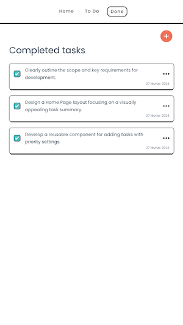

# To Do App Vue Js Project





## Project Overview:

The brief for this project has been created as a self-imposed challenge to elevate my skills in Vue.js development.

Create a straightforward To-Do app with Vue.js 3 and Vuex for global state management. The app will feature multiple pages for organized task management.

## Pages/Tabs:

### Home Page (Dashboard):

- Display a summary of tasks, including the total number of tasks, completed tasks, and pending tasks.
- Show a list of the overdue tasks.

### To-Do List Page:

- Display a list of tasks with their names and deadline.
- Implement functionality to add new tasks.
- Allow users to mark tasks as completed, delete them, or modify them.
- Include a simple filter for viewing tasks by deadline date.

### Completed Tasks Page:

- Show a list of completed tasks.
- Include an option to undo the completion of a task and move it back to the To-Do list.

## State Management (Pinia):

### Modules:

- Create a Pinia store for managing tasks.

## Routing (Vue Router):

### Define Routes:

- Set up routes for each page (Home, ToDoList, CompletedTasks, CreateTask).

## Class-Based Styling with Vue:

- Utilize Vue's built-in class-based styling within each component.

## Persistence:

### Local Storage:

- Implement local storage for task persistence.

## Recommended IDE Setup

[VSCode](https://code.visualstudio.com/) + [Volar](https://marketplace.visualstudio.com/items?itemName=Vue.volar) (and disable Vetur) + [TypeScript Vue Plugin (Volar)](https://marketplace.visualstudio.com/items?itemName=Vue.vscode-typescript-vue-plugin).

## Customize configuration

See [Vite Configuration Reference](https://vitejs.dev/config/).

## Project Setup

```sh
yarn install
```

### Compile and Hot-Reload for Development

```sh
yarn run dev
```

### Compile and Minify for Production

```sh
yarn run build
```

### Lint with [ESLint](https://eslint.org/)

```sh
yarn run lint
```
